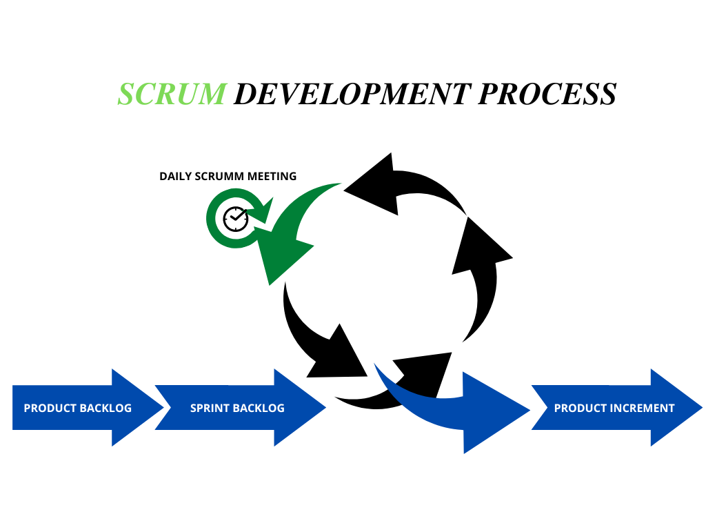
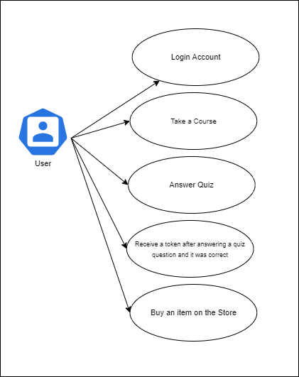
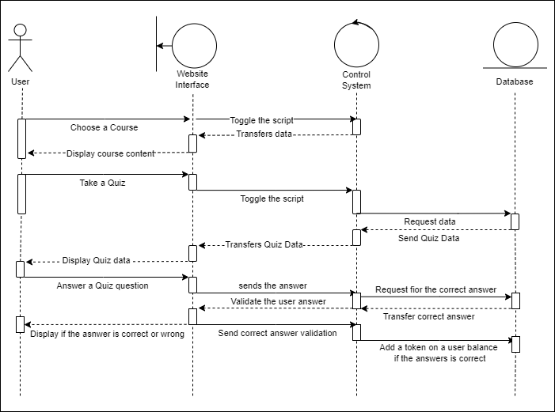

# IT311_Final-Project

A final project for IT 331 - Application Development and Emerging Tech

---

Project Proposal Topic: "Lazatech Educate: A Web-based based Online Learning System About Lazatech Social Media Website and XRP Ledger"

## Abstract:

Even for pros, the world of crypto currency is incredibly confusing. Every person who wishes to enter the crypto realm must first grasp the fundamentals and arm themselves with knowledge to avoid scams and financial loss.

There are several reasons why everyone must possess fundamental knowledge. Some of these factors include avoiding potential rug pull ventures and investing wisely in projects that have the potential to be successful. To address this issue, the developers want to create an application termed "Lazatech Educate" that would provide users with the necessary knowledge before entering the crypto world. "Lazatech Educate" is a web-based application that aims to provide its users with knowledge about the XRP ledger and the "Lazatech Social Media Website Application," a capstone project by Gabriel Edrian Alvaro, Marian Guerra, and Mariel Guerra. Initially, the proposed website application is an online learning website application that comprises courses and lessons about the social media application and its crypto currency integration. It would teach them how to use the capstone project social media website as well as the XRP ledger crypto trading platform.

This project will consist of lessons and quizzes after them. Once a user answers a question and it's correct, they will receive a crypto token to their XRP ledger address. And lastly, the user can use those tokens to avail of the Lazatech merchandise posted on the website. The crypto token that will be distributed on the platform will have a denomination of $LZT. This token is created on the XRP ledger, allowing it to be traded on the crypto exchange platform. The $LZT token, along with its partner-token $LAZA, will be used for future projects. The application and its developers will earn using the COIL platform. Coil web monetization integration would be used in the Lazatech Educate platform for the acquisition of funds for the maintenance of the application. Coil provides an alternative to traditional paid advertising for online monetization. As consumers consume content, Coil employs the interledger protocol (ILP) to broadcast micropayments. The payment channels of the XRPL are a suitable method for settling these micropayments quickly and cheaply.

The project was constructed according to the state design standard. The State design pattern is utilized when an Object's behavior changes dependent on its internal state. If we need to modify the behavior of an object based on its state, we may include a state variable in the Object and use an if-then block to conduct different actions based on the object's state. State pattern is utilized to provide a systematic and loosely connected method for achieving this by implementing Context and State. It was implemented on the quiz page so the user cannot repeatedly take the quiz to prevent tokens from being earned through repetition. And on the courses page, a user cannot access further courses if the course preceding them has not been completed.

Development Model:

The Scrum model implies that projects should evolve over a succession of sprints. In accordance with an agile methodology, sprints are limited to a duration of no more than one month, typically two weeks. Scrum methodology recommends a planning meeting at the beginning of the sprint, during which team members determine how many things they can commit to and then establish a sprint backlog - a list of tasks to be completed during the sprint. Given the time allotted by the professor to complete the project, the scrum model is the optimal choice. Essentially, the fundamental artifact in Scrum development is the product itself. At the conclusion of each Scrum sprint, the Scrum model expects the team to deliver the product or system to a potentially shippable state. Artifacts on the Scrum paradigm are known as states. Product, product backlog, user-stories, sprint burndown chart, sprint backlog, and sprint release burndown chart are included on these artifacts.

## **System Architecture

**Use Case Diagram**

 **Sequence Diagram**

The team presents the aforementioned diagrams to show how users interact with the application. It demonstrates that the user can enroll in a course that will teach them about the XRP ledger and provide it to their users; as a result, this precipitation using the Lazatech Educate mobile application includes lessons and courses about the social media application and its integration with cryptocurrencies.

The user can obtain or receive a token after completing the quizzes is another feature. The user has the option of purchasing an item from the Store to earn money.

## Instructions to run the Project:

Note that your device should have node.js and angular installed globally. If you do have installed them, move on with the instruction below:

1. Clone the repository
2. open your vs code and add the cloned repository
3. open terminal on vs code
4. cd to the project
5. run 'npm install' command in order to create node_modules
6. run "npm install firebase"
7. run "npm install @angular/fire"
8. run "npm install rxjs"
9. then run ionic serve to see if it is working on your browser
10. After registering for a new account you should check your email for verification sometimes the mail goes to spam

Final Video Presentation:

